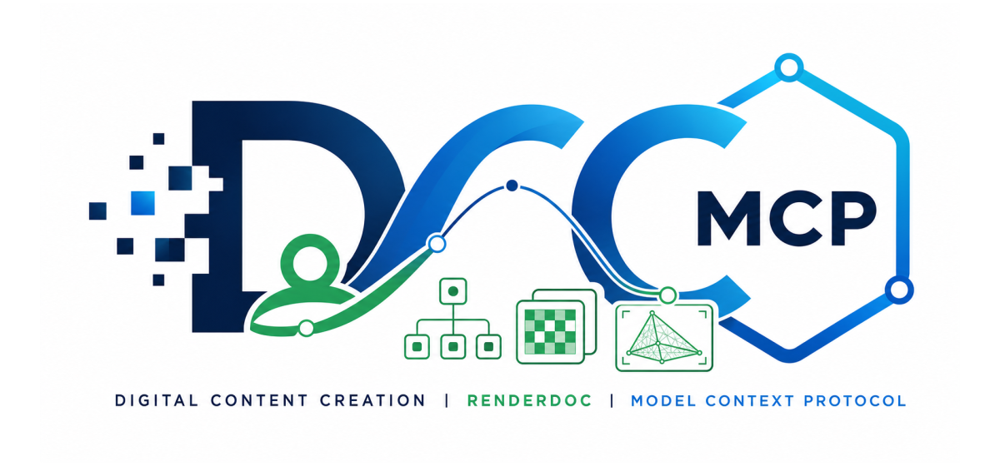

# dcc-mcp-renderdoc

<p align="center">
  
</p>

## Agent workflow

AI agents should use the shared gateway through `dcc-mcp-cli`; IDE users may
continue to use the MCP endpoint. Prefer typed skills and tools over raw scripts.

### Install or update the CLI

`dcc-mcp-cli` is the preferred control path for every shell-capable agent. If
it is missing, ask the user before installing the latest official release:

```bash
# Linux/macOS
curl -fsSL https://raw.githubusercontent.com/dcc-mcp/dcc-mcp-core/main/scripts/install-cli.sh | sh

# Windows PowerShell
powershell -ExecutionPolicy Bypass -c "irm https://raw.githubusercontent.com/dcc-mcp/dcc-mcp-core/main/scripts/install-cli.ps1 | iex"
```

Keep an official build current through the release manifest:

```bash
dcc-mcp-cli update check
dcc-mcp-cli update apply
```

`update apply` downloads and stages the latest CLI for the next launch. It
does not update a running `dcc-mcp-server`; update that server in its own
environment.

```bash
dcc-mcp-cli dcc-types
dcc-mcp-cli list
dcc-mcp-cli search --query "<task>" --dcc-type renderdoc
dcc-mcp-cli describe <tool-slug>
dcc-mcp-cli call <tool-slug> --json '{"key":"value"}'
```

`dcc-types` reports release-catalog support; `list` reports live sessions. If a
tool belongs to an inactive progressive skill, call `dcc-mcp-cli load-skill <skill-name> --dcc-type renderdoc` before retrying. For post-task improvement,
attach a stable session id with `--meta-json`, query `dcc-mcp-cli stats --range 24h --session-id <task-id>`, then pass the bounded evidence to the
`review_skill_improvement` prompt from `dcc-mcp-skills-creator`.


RenderDoc capture and replay automation for the DCC Model Context Protocol ecosystem.

The adapter is headless-first: it reuses the official `renderdoccmd` executable for capture and
conversion. Delayed capture uses RenderDoc's official Target Control API through the sibling
`qrenderdoc` bundled Python runtime, without foreground focus or synthetic keyboard input.

## Install

```bash
pip install dcc-mcp-renderdoc
```

Install RenderDoc separately, then expose its command line tool with either `PATH` or:

```bash
export DCC_MCP_RENDERDOC_CMD=/opt/renderdoc/bin/renderdoccmd
dcc-mcp-renderdoc
```

On Windows, set the variable to `renderdoccmd.exe`.

Each adapter instance uses an OS-assigned MCP port and registers it for CLI discovery. Connect
through the stable gateway at `http://127.0.0.1:9765/mcp`; set
`DCC_MCP_RENDERDOC_PORT` only when a fixed direct endpoint is required.

## Agent workflows

- Launch a game or test executable under RenderDoc and wait for a typed `.rdc` capture.
- Trigger a capture through official Target Control after a configurable delay.
- Inject into a process that had to be launched by a platform client, then trigger and collect a capture.
- Inspect capture driver, machine identity, chunk version, API-call counts, and representative calls.
- Export a capture thumbnail for visual review.
- Export Chrome trace JSON for timeline tooling.

The capture tool launches only the explicit executable and arguments supplied by the caller. It
never invokes a shell. Analysis tools are read-only with respect to the `.rdc` input.

Pass `trigger_after_secs` to `capture_program` for a Target Control trigger. This requires
`qrenderdoc` beside `renderdoccmd`. The official RenderDoc runtime supports Windows and Linux;
macOS is covered only by this project's Python unit tests. Linux Target Control requires an X or
Wayland display, so headless hosts must run under Xvfb (or explicitly configure a working Qt
platform). The official Linux archive does not bundle Qt's `offscreen` platform plugin. Each
sidecar uses an isolated Qt data profile with RenderDoc analytics explicitly opted out, preventing
the first-run consent dialog without reading or changing the user's qrenderdoc configuration.

When a launcher creates the rendered child process, set `hook_children=true` and pass
`trigger_process_name`. The adapter first checks the launched target itself; if its name does not
match, it follows only that target's official `NewChild` messages to find a unique named child. A
child name without child hooking fails before launch. Use `capture_process` only when the target is
already running; late injection may not capture graphics devices created before RenderDoc was
attached.

## Real CI

CI discovers the current stable Linux RenderDoc build from the official downloads page. It
compiles a small OpenGL program, requests a real frame through Target Control under Xvfb using
Qt's bundled `xcb` platform, asserts the structured trigger mode, calls the MCP analysis tool
against the resulting `.rdc`, and verifies thumbnail and timeline exports.

## Development

```bash
uv sync --extra dev
uv run python -m pytest
uv run ruff check src tests tools
uv run python tools/lint_skills.py
```

RenderDoc is an MIT-licensed graphics debugger maintained independently at
[renderdoc.org](https://renderdoc.org/). This adapter is not affiliated with the RenderDoc project.
